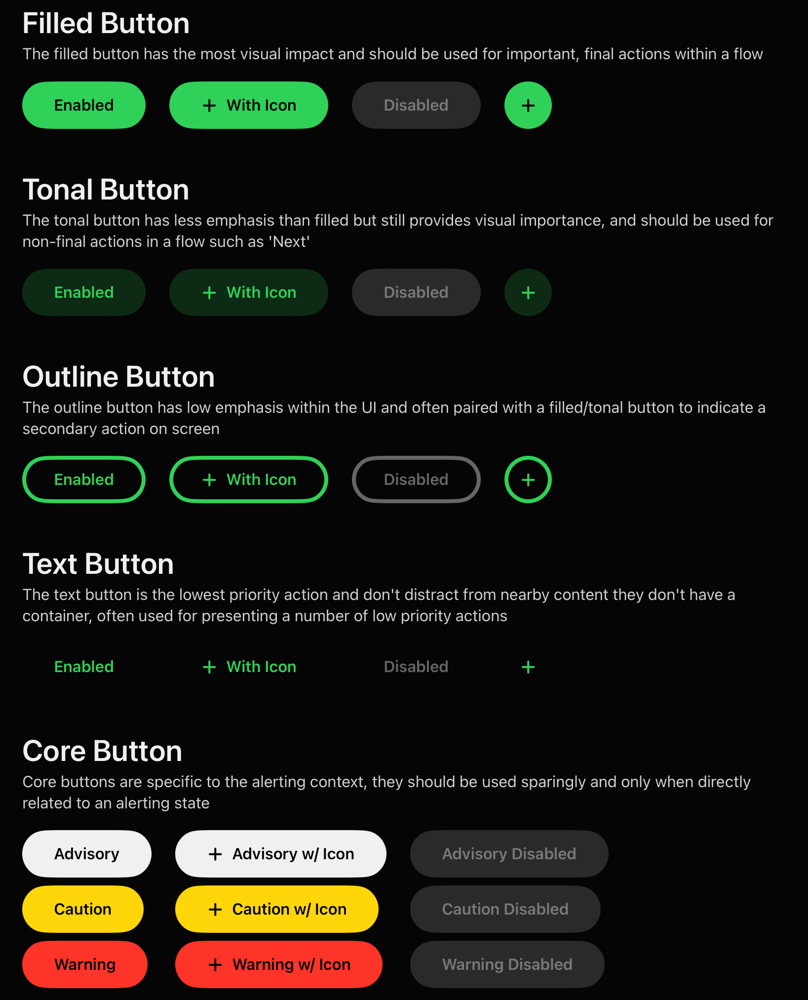

# 🔘 Buttons

FlightUI provides a single, composable button style — `FlightButtonStyle` — that covers every use case through three orthogonal axes: **variant**, **shape**, and an optional **core type**. This keeps the API small and predictable while supporting the full range of actions an aircrew application needs to communicate.



## Button Hierarchy

Aviation UI follows a strict visual hierarchy. Not all actions are equal, and the button style the developer chooses communicates priority to the user before they even read the label. From highest to lowest visual weight:

| Variant | Use for |
|---------|---------|
| `filled` | Primary action on a screen. Use once per context. |
| `tonal` | Secondary action. Related to the primary but less critical. |
| `outline` | Tertiary action or a cancel/back path. |
| `text` | Lowest-priority action, inline links, and destructive confirmations where you want minimum visual noise. |

## Core Types

Core types communicate **situational context** using the colour system defined by the Society of Flight Test Engineers display guidelines. They override the default nominal (green) colour of a button.

| Core Type | Colour | Use for |
|-----------|--------|---------|
| `nominal` | Green | Positive, safe, or proceed actions. Default. |
| `advisory` | Blue (primary) | Informational actions or calculated outputs the pilot must acknowledge. |
| `caution` | Amber | Non-severe warnings. Continuing is technically valid but requires expertise and deliberate intent. |
| `warning` | Red | Severe or potentially life-critical actions. Use sparingly. A warning button should never be the easy path. |

## Shapes

| Shape | Use for |
|-------|---------|
| `capsule` | Labelled text buttons. Default. |
| `circle` | Icon-only buttons. Automatically sized to `theme.size.medium`. |

## Usage

```swift
// Primary action
Button("Confirm Fix") { }
    .buttonStyle(.filled)

// Secondary, neutral action
Button("Recalculate") { }
    .buttonStyle(.tonal)

// Tertiary / cancel
Button("Cancel") { }
    .buttonStyle(.outline)

// Text only
Button("Clear all data") { }
    .buttonStyle(.text)

// Icon-only (circle shape)
Button { } label: { Image(systemName: "plus") }
    .buttonStyle(.filledIcon)

// Core type — caution context
Button("Override") { }
    .buttonStyle(.caution)

// Full configuration control
Button("Custom") { }
    .buttonStyle(.custom(variant: .tonal, shape: .capsule, coreType: .warning))
```

## Available Static Shortcuts

### Capsule (labelled text)

| Style | Variant | Core Type |
|-------|---------|-----------|
| `.filled` | filled | nominal |
| `.tonal` | tonal | nominal |
| `.outline` | outline | nominal |
| `.text` | text | nominal |
| `.advisory` | filled | advisory |
| `.caution` | filled | caution |
| `.warning` | filled | warning |

### Circle (icon-only)

| Style | Variant |
|-------|---------|
| `.filledIcon` | filled |
| `.tonalIcon` | tonal |
| `.outlineIcon` | outline |
| `.textIcon` | text |

## Disabled State

Pass `.disabled(true)` to any button. FlightUI automatically reduces the button to a neutral disabled colour at 38% opacity (Material Design standard). This applies to all variants and shapes.

```swift
Button("Submit") { }
    .buttonStyle(.filled)
    .disabled(!formIsValid)
```

## Press Feedback

All buttons animate on press: opacity drops to 60% and the button scales to 95%, giving a clear physical response without the system default highlight. The animation uses `.easeInOut(duration: 0.1)`.

## Accessibility

- Minimum tap target: `theme.size.medium` (48pt by default) for all shapes.
- Core type colours all meet WCAG AA contrast on the `background`, `surfaceLow`, and `surfaceHigh` backgrounds. Warning (red) meets AA; nominal, caution, and advisory meet AAA.
- `caution` and `warning` buttons should always carry a descriptive label, not just an icon, so the action is unambiguous under stress.

## When Not to Use a Warning Button

A warning button is not simply a "destructive" action button. It should be reserved for actions where proceeding could directly impact the safety of the operation. For routine destructive actions (delete, clear, reset), prefer an `outline` or `text` button paired with a confirmation dialog.
