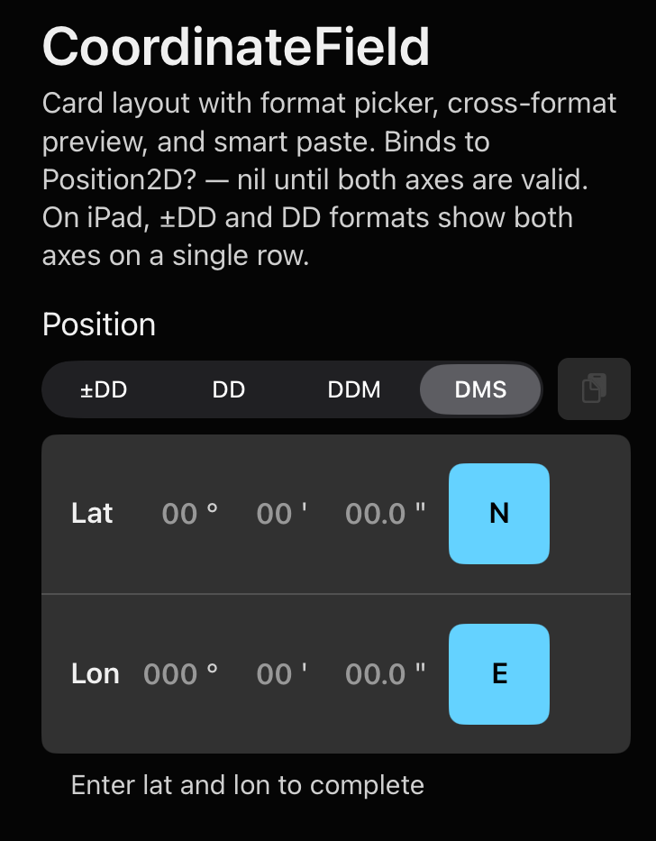

# Coordinate Entry

Segmented input fields for geographic position entry. Supports four formats, binds directly to [AviationMaths](https://github.com/danleedham/AviationMaths) types, and applies per-segment out-of-range validation following ISO 6709.



## Requirements

FlightUI depends on [AviationMaths](https://github.com/danleedham/AviationMaths). Host apps that bind to `Latitude`, `Longitude`, or `Position2D` in their own code must also add AviationMaths as an explicit package dependency. SwiftPM deduplicates packages automatically — using the same URL/version causes no type conflicts and no binary duplication.

## Components

| Component | Binding | Description |
|-----------|---------|-------------|
| `LatitudeField` | `Latitude?` | Single-axis lat entry |
| `LongitudeField` | `Longitude?` | Single-axis lon entry |
| `CoordinateField` | `Position2D?` | Stacked lat + lon with built-in format picker and cross-format preview |

---

## CoordinateFormat

```swift
public enum CoordinateFormat: String, Sendable, CaseIterable {
    case signedDecimalDegrees  // ±DD  — e.g. -51.47520°  (no hemisphere toggle)
    case decimalDegrees        // DD   — e.g. 51.47520° N
    case ddm                   // DDM  — e.g. 51° 28.512' N  (default)
    case dms                   // DMS  — e.g. 51° 28' 30.7" N
}
```

MGRS is planned for a future release.

---

## CoordinateField

Full position entry with a built-in format picker (±DD / DD / DDM / DMS) and a live cross-format preview:

```swift
@State var position: Position2D? = nil
@State var format: CoordinateFormat = .ddm

CoordinateField(
    position: $position,
    format: $format
)
```

`position` is `nil` until both lat and lon segments are complete and in-range.

The built-in picker handles all format switching — do not add a second external picker. The `format` binding is still useful for persistence (e.g. `@AppStorage`) and reading the current format for offset display.

On iPad (`.regular` width) all four formats place lat and lon on a single row. On iPhone they stack with lat above lon.

When embedded in a SwiftUI `Form`, the component automatically applies `.listRowBackground(Color.clear)` so only the card background shows. No `.listRowInsets` override is needed.

---

## LatitudeField

```swift
@State var latitude: Latitude? = nil
@State var format: CoordinateFormat = .ddm

LatitudeField(
    latitude: $latitude,
    format: $format,
    topLabel: "Latitude",
    bottomLabelConfig: BottomLabelConfig("51° 28.512' N", state: .nominal)
)
```

### Parameters

| Parameter | Type | Default | Description |
|-----------|------|---------|-------------|
| `latitude` | `Binding<Latitude?>` | required | Receives valid value or `nil` |
| `format` | `Binding<CoordinateFormat>` | required | Controls visible segments |
| `topLabel` | `String?` | `nil` | Label above the field |
| `topLabelSpacer` | `Bool` | `false` | Invisible spacer for alignment |
| `bottomLabelConfig` | `BottomLabelConfig` | hidden | Label below the field |
| `alertingState` | `InputAlertingState` | `.default` | Visual state for all segments |
| `config` | `CoordinateFieldConfig` | `.standard` | Theme overrides |
| `onSegmentFilled` | `(@Sendable () -> Void)?` | `nil` | Hook for custom focus advancement |

---

## LongitudeField

Identical to `LatitudeField` with `Longitude?` binding and E/W hemisphere toggle. Degrees range 0–180. Note: `onSegmentFilled` is not available on `LongitudeField`.

```swift
LongitudeField(
    longitude: $longitude,
    format: $format,
    topLabel: "Longitude"
)
```

---

## Segment Layouts

Hemisphere indicators follow the digits per ISO 6709.

### DDM (default)

```
[51  °]   [28.512  ']   [N]
```

### DMS

```
[51  °]   [28  ']   [30.7  "]   [N]
```

### DD (Decimal Degrees)

```
[51.47520  °]   [N]
```

### ±DD (Signed Decimal Degrees)

```
[-51.47520  °]
```

No hemisphere toggle. Positive = N/E, negative = S/W.

---

## Alerting States

Each segment independently shows `.warning` when its value is outside the valid range (e.g. degrees > 90 for latitude). The overall field colour follows the `alertingState` parameter.

```swift
// Confirmed nominal position
LatitudeField(latitude: $latitude, format: $format, alertingState: .nominal)

// Warning — pilot must acknowledge
LatitudeField(latitude: $latitude, format: $format, alertingState: .warning)
```

---

## Configuration

Override theme defaults with `CoordinateFieldConfig`:

```swift
CoordinateField(
    position: $position,
    format: $format,
    config: CoordinateFieldConfig(
        fontColor: theme.color.nominal,
        backgroundColor: theme.color.surfaceLow,
        cardinalStyle: .segment,
        secondsPrecision: 2,
        cardinalColor: .green
    )
)
```

### CoordinateFieldConfig Parameters

| Parameter | Type | Default | Description |
|-----------|------|---------|-------------|
| `fontColor` | `Color?` | `nil` | Segment input text colour |
| `fontStyle` | `FontStyle?` | `nil` | Segment input font |
| `backgroundColor` | `Color?` | `nil` | Segment input background |
| `cornerRadius` | `CGFloat?` | `nil` | Segment corner radius |
| `borderColor` | `Color?` | `nil` | Segment border colour |
| `cardinalStyle` | `CardinalInputStyle` | `.segment` | Hemisphere selector style |
| `secondsPrecision` | `Int` | `1` | Decimal places for seconds in DMS |
| `cardinalColor` | `Color?` | `nil` | Highlight colour for the cardinal button/pill. `nil` uses `theme.color.inputOutput` |

Use the `highContrast` preset for sunlit cockpit environments:

```swift
config: .highContrast(theme: theme)
```

### CardinalInputStyle

Controls how the hemisphere selector (N/S or E/W) is displayed:

```swift
public enum CardinalInputStyle: Sendable {
    case button   // Compact square button — tapping cycles N ↔ S (or E ↔ W).
    case segment  // Both directions shown side-by-side; the active one is highlighted. Default.
}
```

---

## Format Switching

Changing `format` while a valid value is in the binding automatically converts the segments to the new format. If the binding is `nil` when the format changes, all segments are cleared.

```swift
// Persist user's preferred format
@AppStorage("coordinateFormat") var formatRaw: String = CoordinateFormat.ddm.rawValue
var format: CoordinateFormat {
    get { CoordinateFormat(rawValue: formatRaw) ?? .ddm }
    set { formatRaw = newValue.rawValue }
}
```

---

## Validation Model

The binding only receives a typed value when **all** segments are filled and **all** are in-range. Invalid intermediate state is never written to the binding — this prevents the `precondition()` crash in AviationMaths initialisers.

| Segment | Valid range |
|---------|------------|
| Lat degrees (DDM/DMS) | 0 – 90 |
| Lon degrees (DDM/DMS) | 0 – 180 |
| Minutes (DDM) | 0 – 59.999 |
| Minutes (DMS) | 0 – 59 |
| Seconds (DMS) | 0 – 59.9… |
| ±DD latitude | -90.0 – 90.0 |
| ±DD longitude | -180.0 – 180.0 |

---

## Focus Advancement

Auto-advance between segments is **not** implemented by default. Use the `onSegmentFilled` closure on `LatitudeField` to drive your own `@FocusState` logic:

```swift
LatitudeField(
    latitude: $latitude,
    format: $format,
    onSegmentFilled: {
        focusedField = .longitude
    }
)
```
