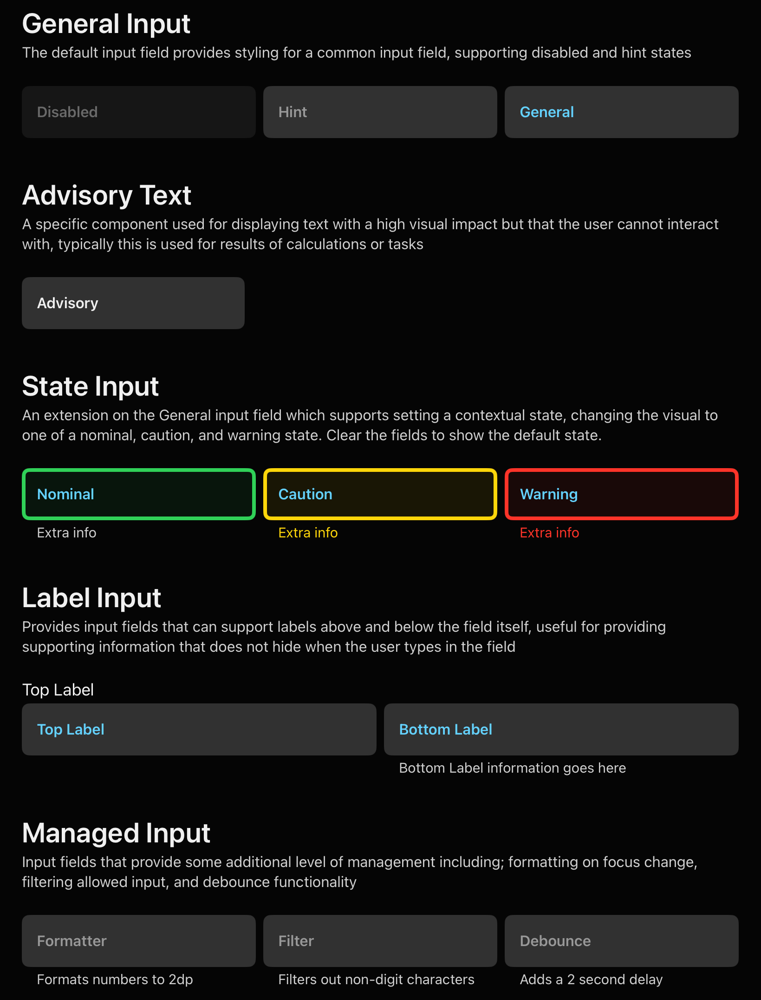

# ⌨️ Inputs

FlightUI provides two input components — `InputField` and `MenuField` — along with an unbound variant for dynamic option lists. Both support the same alerting state system used throughout the library, the same label conventions, and the same theming.



## Alerting States

Every input field has an `InputAlertingState` that drives its visual appearance. This is not just validation feedback — it communicates the **nature** of the field to the pilot at a glance, before they interact with it.

| State | Border | Background | Use for |
|-------|--------|------------|---------|
| `.default` | None | `surfaceHigh` | Standard user input |
| `.advisory` | Primary (blue) | Subtle blue tint | Calculated output the user should review, not edit |
| `.nominal` | Green | Subtle green tint | Confirmed valid input |
| `.caution` | Amber | Subtle amber tint | Input that is technically valid but requires expert judgement |
| `.warning` | Red | Subtle red tint | Invalid, out-of-range, or safety-critical error |

Setting a field to `.advisory` and making it non-interactive is the recommended pattern for displaying a computed result alongside the inputs that produced it.

## `InputField`

A themed `TextField` with optional number formatting, input filtering, character limits, and labelling.

```swift
// Basic text input
InputField(text: $callsign, placeholder: "Callsign")

// With top label and validation state
InputField(
    text: $speed,
    placeholder: "kt",
    topLabel: "Airspeed",
    bottomLabelConfig: BottomLabelConfig(
        label: "Must be between 80 and 350 kt",
        state: .caution,
        show: speedOutOfRange
    )
)
.inputFieldStyle(.caution)

// Advisory / read-only output
InputField(
    text: $computedRange,
    placeholder: "—",
    topLabel: "Range to Target"
)
.inputFieldStyle(.advisory)
.disabled(true)
```

### Decimal Input

Use the `.decimal` factory for numeric decimal fields. The formatter formats to a fixed number of decimal places on focus loss.

```swift
InputField.decimal(
    value: $altitude,
    placeholder: "ft",
    topLabel: "Altitude",
    maxInteger: 5,
    fractionDigits: 0
)
```

### Integer Input

```swift
InputField.integer(
    value: $heading,
    placeholder: "°",
    topLabel: "Heading",
    minDigits: 3,
    maxDigits: 3
)
```

### Filtering

The `filter` parameter prevents invalid characters from being typed. Use the built-in `RegexFilter` cases or provide a custom regex.

| Filter | Allows |
|--------|--------|
| `.integerOnly` | Digits 0–9 |
| `.doubleOnly` | Digits and `.` |
| `.letterOnly` | A–Z, a–z |
| `.noDigits` | Everything except digits |
| `.custom(String)` | Any regex pattern |

```swift
InputField(
    text: $icaoCode,
    placeholder: "EGLL",
    filter: .letterOnly,
    maxCharacterCount: 4
)
```

### Labels

Both top and bottom labels are optional.

- **Top label** (`topLabel: String`) — appears above the field, `caption1` typography, secondary colour.
- **Top label spacer** (`topLabelSpacer: Bool`) — when `true`, reserves the top label space even if no label is provided. Use this to vertically align a row of fields where only some have top labels.
- **Bottom label** (`bottomLabelConfig: BottomLabelConfig`) — appears below the field with a `show` toggle and an `InputAlertingState` that drives its colour. Use for validation messages, hints, and range guidance.

```swift
BottomLabelConfig(
    label: "Valid range: 0–360°",
    state: .default,
    show: true
)
```

## `MenuField`

A themed picker presented as a tappable field with a trailing chevron. Use for selecting from a bounded, well-known list of options.

```swift
@State private var selectedUnit: SpeedUnit = .knots

MenuField(
    selection: $selectedUnit,
    options: SpeedUnit.allCases,
    placeholder: "Unit",
    topLabel: "Speed Unit"
)
```

The generic `T` must conform to `CustomStringConvertible & Hashable`. The `description` property is used as the display string.

### States and Config

`MenuField` supports the same `.inputFieldStyle()`, `topLabel`, `bottomLabelConfig`, and disabled patterns as `InputField`.

## `UnboundMenuField`

Use when the list of options is dynamic and the user may need to create a new option that does not yet exist. It presents a full-screen bottom sheet with a searchable list. If the user types a string that matches no option, they are offered a "Use [typed string]" row that creates a custom option.

The type `T` must conform to `UnboundSelectionEnum`, which requires `CaseIterable`, `CustomStringConvertible`, `Sendable`, and a `static func custom(string: String) -> Self` factory.

```swift
UnboundMenuField(
    selection: $selectedAircraft,
    options: Aircraft.allCases,
    placeholder: "Select or type aircraft type",
    topLabel: "Aircraft"
)
```

## Consistent Alignment

When laying out a form with multiple fields, use `topLabelSpacer: true` on any field that has no top label to ensure all fields sit at the same vertical baseline. This maintains the grid and makes the form scannable in a single pass.

## Keyboard and Focus

`InputField` manages its own `@FocusState`. Tapping outside the field dismisses the keyboard. The field formats its value (if a formatter is provided) when it loses focus — not during typing — so the user sees the raw input while editing and the formatted result when done.
